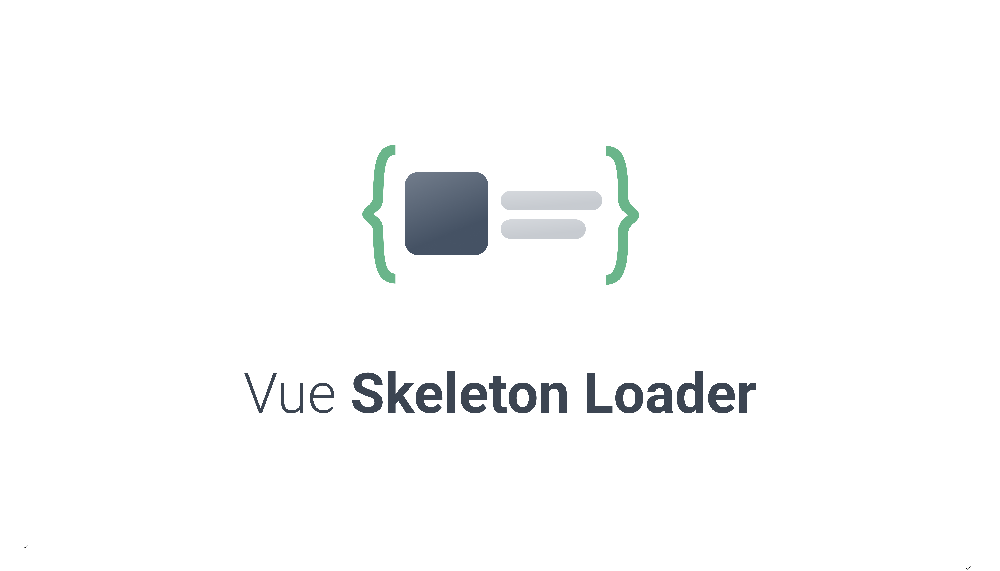

[](https://github.com/medistream-team/v-skeleton-loader/actions/workflows/deploy-demo.yml) [](https://github.com/medistream-team/v-skeleton-loader/actions/workflows/npm-publish.yml)

## [DEMO](https://medistream-team.github.io/v-skeleton-loader)

## Installation

<pre>
<code>npm i v-skeleton-loader</code>
</pre>

## Plugin

<pre>
<code>import VSkeletonLoader from 'v-skeleton-loader';

Vue.use(VSkeletonLoader);</code>
</pre>

## Component

### Content

You can implement multiple types of skeleton loaders simultaneously using content property.

```html
<template>
  <v-skeleton-loader :content="thumbItem"></v-skeleton-loader>
</template>

<script>
import VSkeletonLoader from 'v-skeleton-loader';
export default {
  components: {
    VSkeletonLoader
  },
  data () {
    return {
      thumbItem: ['box', 'text']
    }
  }
}
</script>
```

```html
<template>
  <v-skeleton-loader :content="cardItem"></v-skeleton-loader>
</template>

<script>
import VSkeletonLoader from 'v-skeleton-loader';
export default {
  components: {
    VSkeletonLoader
  },
  data () {
    return {
      cardItem: [
        ['blank', 'circle:100', 'blank'],
        ['title'],
        ['text:3']
      ]
    }
  }
}
</script>
```

### Options

Options allow you to implement different styles of Skeleton Loaders.

```html
<v-skeketon-loader
  :options="{
    radius: 3,
    primaryColor: '#94bcff',
    secondaryColor: '#c7dcff',
    animate: true,
    speed: '1.5s',
    defaultSizes: {
      box: 100,
      circle: 100,
      title: 25,
      text: 15,
    }
  }">
</v-skeketon-loader>
```

## 📝 License

Copyright © 2022. Built by INTEGRATION Corp.<br>
This project is distributed under [MIT](https://github.com/medistream-team/v-skeleton-loader/blob/main/LICENSE) license.
